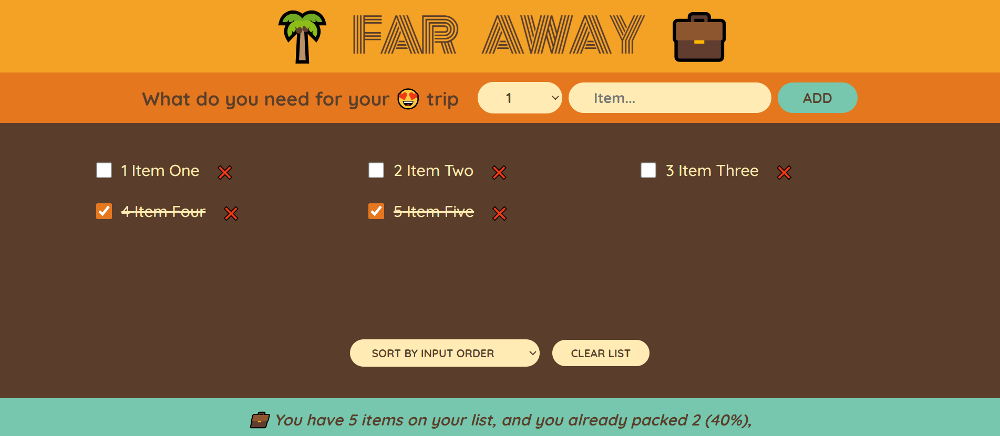

# Far Away: Travel List React App

### Live Demo: https://adilarain00.github.io/Travel-List-App

### Description.

Far Away Travel List is a beautifully crafted React.js app designed to help users manage their travel plans. Built using React.js, the app features an easy-to-use list where you can add, sort, mark as completed, and delete travel plans. The responsive design ensures a seamless experience across all devices, with a footer summarizing your completed and pending travels.

### Functionalities.

With components, prop drilling, and the useState Hook, the app allows you to add new destinations to your list, view them in a showcase area, mark completed trips, delete items, and sort your list. The responsive design ensures a seamless experience across all devices, with a footer summarizing your completed and pending travels.
